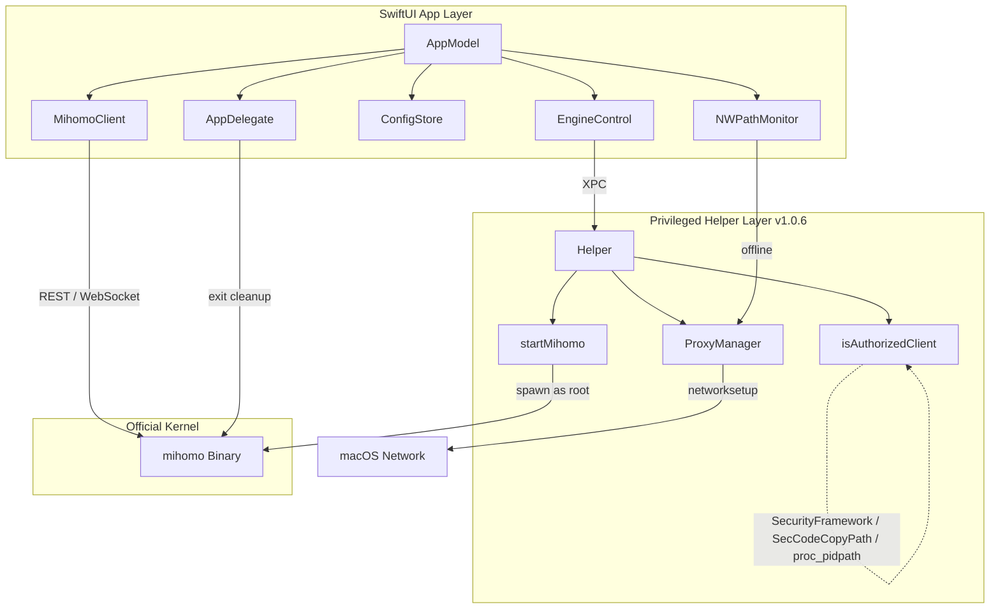

# ClashPow 架构说明

ClashPow 是「原生编排器」：纯 Swift GUI 直接驱动官方 `mihomo` (Clash.Meta) 内核，特权操作交由独立签名的 Helper。无中间引擎层，GUI 直连内核 REST/WS。

## 逻辑分层

### 1. GUI 层（`Sources/`，全 `@MainActor`）

- **AppModel**（`Model/AppModel.swift`）：单一真相源 + 编排中枢（`AppModel.shared`），持有 `api`/`engine`/`store`/`history`，驱动全部 UI。按功能拆分为 4 个 extension：
  - `AppModel+Config.swift`：配置/开关域（`toggleTUN` / `toggleSystemProxy` / `patch` / `activateProfile` / `patchPersistent`）
  - `AppModel+Proxies.swift`：代理组/节点/延迟测速
  - `AppModel+Connections.swift`：连接快照/流量聚合/仪表盘
- **MihomoClient**（`XPC/MihomoClient.swift`）：纯 Swift REST/WS 客户端。`probe()` 探活；`stream()` 订阅 `/traffic`、`/connections`、`/logs`（断线自动重连）；启动时 `applyController(fromConfigAt:)` 从 config 发现 external-controller/secret。
- **EngineControl**（`XPC/EngineControl.swift`）：内核生命周期（`ensureInstalled`/`ensureRunning`/`restart`/`stopKernel`）与「用户态 ↔ Root 态」切换；`kExpectedHelperVersion` 驱动自动升级；`syncRunningAsRootIfNeeded()` 用 `pgrep` 同步 root 状态。
  - **YAML 增强**：`setNestedScalars` 允许安全地原子化改写 `config.yaml` 中的嵌套块（如 `tun`, `dns`, `sniffer`），确保 UI 上的修改能永久落地。
- **ConfigStore**（`Model/ConfigStore.swift`）：多套 YAML profile 管理，远程订阅 URL 存 Keychain。
- **AppDelegate**（`App/ClashPowApp.swift`）：`applicationWillTerminate` + SIGTERM/SIGINT handlers → `killall -9 mihomo` + `setSystemProxy(false)`；一次性 `DispatchSemaphore` 防竞争。
- **NWPathMonitor**（`AppModel.swift`）：离线时自动关闭系统代理。

### 2. UI 扩展层 (WebView Panels)
- **Zashboard 集成**：通过 `WKWebView` 嵌入官方托管的 Zashboard 面板。采用 **Hash 参数注入技术** (`#/?hostname=...&secret=...`) 绕过跨域限制，实现打开即连的免密自动登录。

### 3. 特权 Helper 层（`Sources/Helper/` + `Sources/XPC/`）

- 独立编译的 LaunchDaemon（**v1.0.6**），Mach service `com.clashpow.helper`，经 `HelperProtocol` 做 XPC。
- 能力：`getVersion` / `setSystemProxy` / `startMihomo` / `stopMihomo`。
- **`isAuthorizedClient` 三层鉴权**：
  1. `SecCodeCheckValidity(kSecCSBasicValidateOnly, identifier "com.clashpow.app")` — 跳过可执行+资源校验，兼容 ad-hoc 签名
  2. `SecCodeCopyStaticCode` + `SecCodeCopyPath` — bundle 根路径回退
  3. `proc_pidpath` — 直接读取进程可执行路径，不依赖签名框架；ad-hoc 必然通过
- `startMihomo`：先 `killall -9 mihomo` 清理遗留进程，再启动；三段式 stop（SIGTERM → 1.5s 等待 → SIGKILL）。
- **版本管理**：`XPCManager.upgradeDaemon()` = `uninstallDaemon()` + 800ms 间隔 + `installDaemon()`；`EngineControl.checkAndUpgradeHelperIfNeeded()` App 启动 4s 后静默调用。
- 安装/卸载/升级均由 `XPCManager` 经 `osascript ... with administrator privileges` 完成。

### 3. 内核层
官方 `mihomo`（darwin-arm64）。直接处理网络报文，GUI 仅展示与控制。**签名时故意不加 `--options runtime`**（hardened runtime 阻断 `AF_SYSTEM` socket，utun TUN 设备无法创建）。

## 核心工作流

**启动：**
`AppModel.start()` → `ensureInstalled`（seed 内核 + 规范化 config）→ `applyController` 发现端点 → `ensureRunning` → `reconnect` 握手 → 建 WS 长连 + 3s 轮询 → **4s 后 `checkAndUpgradeHelperIfNeeded`** 检测并静默升级 helper。

**TUN 开启（`toggleTUN`）：**
1. 检查 `engine.isRoot` + `engine.helperVersion`
2. 未装 Helper → `installPrivileged()` 弹授权
3. Helper 版本过旧 → `upgradeDaemon()` 静默升级
4. `engine.restart()` 杀旧内核、以 root 重启（via Helper `startMihomo`）
5. **轮询等待**（最多 10s）：`api.reachable && engine.runningAsRoot`
6. `reconnect()` 重建 WS 连接
7. PATCH `tun.enable=true` → `refreshConfigs()` 确认（`enable && runningAsRoot`）

**runningAsRoot 同步：**
- `ensureRunning()`：kernel 已在线时 `pgrep -u root -x mihomo` 判断是否已 root，避免无谓重启
- `pollStatus()`（每 2s）：helper 活跃 + api 可达 + `runningAsRoot=false` 时自动同步

**退出清理：**
`AppDelegate.applicationWillTerminate` / SIGTERM / SIGINT → `AppDelegate.performCleanup()`（一次性锁）→ `killall -9 mihomo` + helper XPC `setSystemProxy(false)`

**系统代理：** 优先 Helper XPC，否则 `networksetup` osascript 兜底；`NWPathMonitor` 离线自动关闭。

**配置变更：** 经 `/configs` PATCH（内核校验+回滚）；切换 profile 写文件 + `?force=true` PUT 热重载。

## 默认连接参数
external-controller 绑回环 `127.0.0.1`，secret 启动时规范化为强随机值。数据目录 `~/Library/Application Support/ClashPow`。Helper 日志：`/Library/Logs/ClashPow/helper.log`；mihomo root 日志：`/Library/Logs/ClashPow/mihomo-root.log`。

## UI 信息架构
侧栏 3 组:监控(仪表盘/连接/日志)· 代理(代理/规则/订阅)· 配置(配置编辑/网络/SD-WAN/通用设置)。
「网络」是聚合页(`NetworkHubPage`),内部 tab 切换 入站/TUN/DNS/嗅探/内核;内核管理唯一入口在此。
菜单栏 `MenuBarPanel` 提供开关/节点/配置/快捷/导航/自启与 Dock,主窗口为单实例 `Window` scene。

**配置写入两条路径**:运行时可改的 key 走 `AppModel.patch`(`/configs` PATCH);加载期 key(geodata-*/unified-delay/keep-alive…)走 `patchPersistent`(写 config.yaml + reload,reload 前回写 TUN 态)。proxy-provider 增删改经 `saveProxyProviders`(备份→`mihomo -t`→失败回滚→reload)。

## 设计系统 (DesignTokens)
`Sources/UI/DesignTokens.swift` 是 UI 单一真相源：`DS.Palette`（表面/状态/中性填充边框）、`DS.Spacing`（8pt 栅格）、`DS.Radius`、`DS.Icon`（图标尺寸,独立于文本刻度）、`DS.Layout`（复用固定尺寸）+ `Font.ds*`（24/20/14/12 类型刻度）。所有 UI 一律读 token，不写裸字面量。
- **暗色锁定**：`cardBg/cardBgAlt` 是暗色固定值,App 锁 `.preferredColorScheme(.dark)`；要支持浅色需先把表面色改为随 scheme 自适应（Asset Catalog 或 `Color(nsColor:)` 动态色）。
- **防回归**：`.githooks/pre-commit` 对 UI 文件里裸 `.font(.system(size: N))` 与脱离刻度的语义字体 `.caption/.callout/…` 给 **DS-WARN**（不阻断）。
- **可视化自检**：`DesignTokens.swift` 内含 `#Preview "Design Tokens"` token 画廊；`NetworkPage`/`DashboardPage`/`GeneralPage` 各有 `#Preview`,可在 Xcode 画布快速核对布局。
- **后续**：完整快照回归测试需新增 XCTest target + `swift-snapshot-testing`（受当前 `.xcodeproj` 无测试 target 限制,留作后续）。
