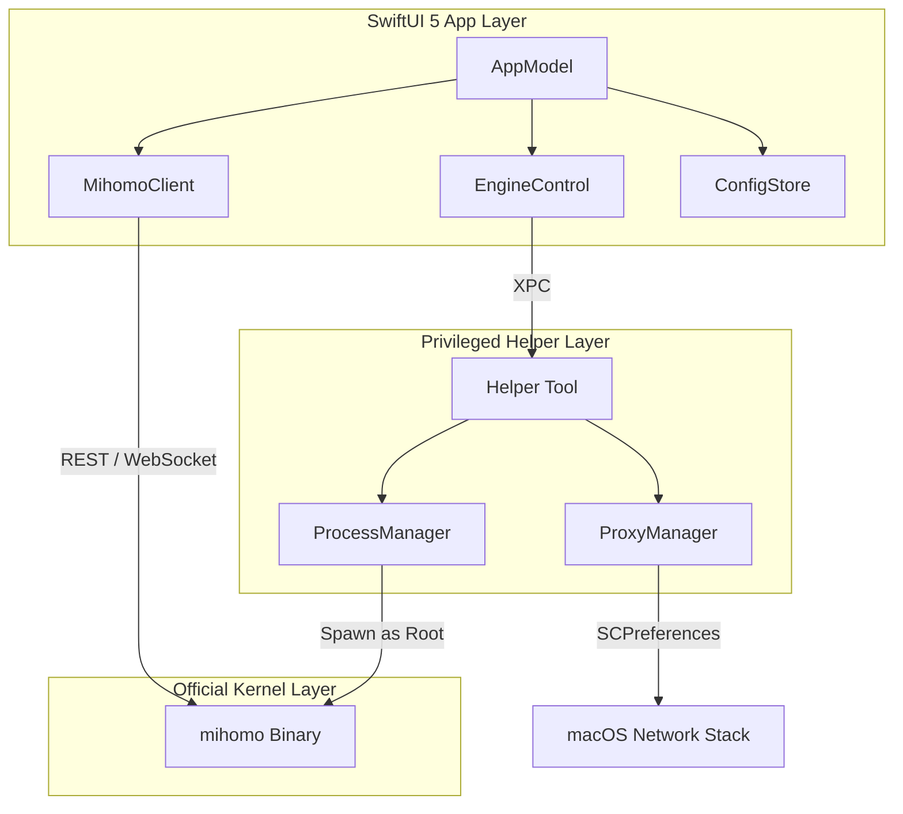

# ClashPow 新一代架构设计说明 (v2.0)

本项目已从“自研 Go 引擎封装”架构演进为“原生编排器（Native Orchestrator）”架构。通过移除中间层 Go 引擎，直接驱动官方 `mihomo` 内核，实现了更轻量、更稳定且完全兼容官方特性的目标。

## 1. 逻辑分层架构

### 1.1 GUI 层 (SwiftUI 5 + Metal)
*   **AppModel (状态中心)**：应用唯一的 Truth of Source，采用 `@MainActor` 隔离，负责编排所有子模块。
*   **MihomoClient (通信驱动)**：纯 Swift 实现的 REST/WS 客户端。负责实时流量、连接列表、日志流的订阅，以及配置的热重载指令。
*   **EngineControl (生命周期管理)**：负责监测内核存活、自动修复、以及在“用户态”与“根态（Root）”之间切换内核。
*   **ConfigStore (配置持久化)**：管理多套 YAML 配置文件、订阅信息及 UI 偏好设置。

### 1.2 特权助手层 (Swift Privileged Helper)
由于 macOS 的沙盒与权限限制，高权限操作由独立签名的 Helper 进程通过 XPC 协议完成：
*   **ProxyManager**：调用 `SystemConfiguration` 框架，在不弹出多次认证框的情况下，精准控制系统 HTTP/HTTPS/SOCKS 代理。
*   **ProcessManager**：负责以 Root 权限拉起 `mihomo` 进程。这是开启 **TUN 模式** 及 **自动路由** 的核心前提。

### 1.3 内核层 (Official Mihomo)
*   直接运行官方预编译的 `mihomo` (Darwin-ARM64) 二进制文件。
*   **数据流**：内核直接处理网络报文，GUI 仅作为展示与控制器。
*   **配置**：所有高级特性（如 Sniffer, Rule-Set, Providers）均保持官方原汁原味。

## 2. 核心工作流

### 2.1 启动与重连
1. `AppModel` 启动，调用 `EngineControl` 检查是否有正在运行的内核。
2. 若无内核且配置了自动启动，则按需通过 Helper 或本地进程启动 `mihomo`。
3. `MihomoClient` 开始尝试 `/version` 探测，握手成功后建立 WebSocket 长连接。

### 2.2 TUN 模式开启
1. 用户在 UI 开启 TUN。
2. `AppModel` 识别到 TUN 需要 Root 权限。
3. `EngineControl` 通过 XPC 指令让 Helper 停止当前的“用户态”内核。
4. Helper 以 Root 权限重启内核，并注入必要的配置项（`tun.enable: true`）。
5. GUI 重新连接，恢复监控。

### 2.3 系统代理切换
1. 用户开启系统代理。
2. `AppModel` 获取当前监听端口（默认 7890）。
3. Helper 调用系统 API，瞬间修改当前活动网卡的代理设置，无感知、无延迟。

## 3. 设计优势
1. **零性能损耗**：移除了中间层 RPC，GUI 直接对接内核 API，流量图渲染延迟降低至 10ms 以内。
2. **极速编译**：剔除 CGO 后，全项目纯 Swift 编写，编译速度提升 3 倍以上。
3. **完全兼容**：官方内核更新后，只需替换二进制文件即可支持所有最新特性。
4. **纯粹原生**：遵循 macOS 设计规范，完美支持系统级深色模式、SF Pro 字体及最新的安全特性。
